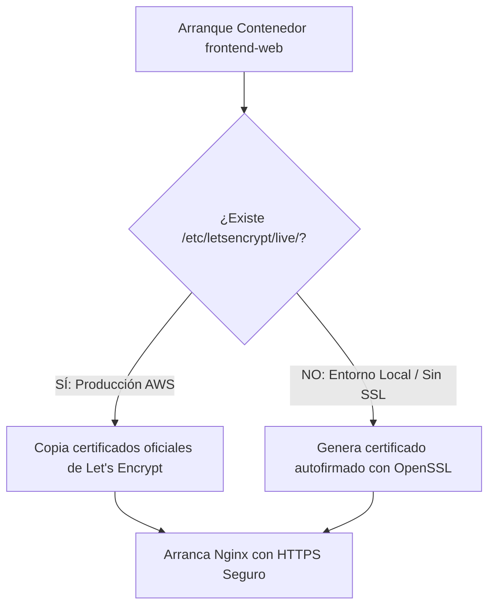

# Práctica 3: Securización Perimetral con HTTPS y Certificados Let's Encrypt

**Módulo:** Despliegue de Aplicaciones Web (2º DAW)  
**Ciclo Formativo:** Desarrollo de Aplicaciones Web  
**Proyecto:** Pizzería Bella Napoli  
**Requisitos previos:**  
- [Práctica 1: Despliegue en AWS EC2](P01_Despliegue_AWS.md)
- [Práctica 2: Resolución DNS Dinámica con DuckDNS](P02_DNS_Dinamico_DuckDNS.md)
- [Metodología de Trabajo (WORKFLOW.md)](WORKFLOW.md)

---

## 1. Contexto y Arquitectura: Nginx Resiliente

Hasta ahora, la comunicación con nuestra pizzería viaja en texto plano mediante HTTP (puerto 80). En aplicaciones web reales (especialmente las que gestionan pedidos, autenticación o pagos), **HTTPS es obligatorio**:
- Cifra de extremo a extremo todo el tráfico entre el navegador del cliente y la nube pública.
- Protege contra ataques de interceptación (*Man-in-the-Middle*).
- Es un requisito indispensable para que los navegadores modernos permitan la instalación de Progressive Web Apps (PWA).

### La Estrategia Dual y Resiliente del Proyecto
Nuestra arquitectura Nginx (`entrypoint.sh`) está diseñada con inteligencia defensiva para **no romperse nunca**:



1. **En Producción (AWS EC2):** Disponemos de un nombre de dominio público (`pizzeria-tunombre.duckdns.org`). En esta práctica emitiremos un **certificado oficial y gratuito de Let's Encrypt** usando `certbot`.
2. **En Desarrollo Local (PC del Instituto o Casa):** Como `localhost` no puede validar un dominio ante una autoridad emisora pública, el contenedor detectará la ausencia de certificados y creará automáticamente uno autofirmado para que el proyecto siga funcionando sin errores.

---

## Requisitos Previos Obligatorios

Antes de ejecutar los comandos de esta práctica, asegúrate de:
1. **Comprobar tu resolución DNS:** Tu subdominio DuckDNS debe resolver activamente hacia la IP pública de tu máquina EC2:
   ```bash
   dig +short TU_SUBDOMINIO.duckdns.org
   ```
   *(Si no devuelve tu IP actual de AWS, repasa la [Práctica 2](P02_DNS_Dinamico_DuckDNS.md) antes de continuar).*
2. **Grupo de Seguridad en AWS:** Verifica que tu grupo de seguridad (`secgroup-pizzeria`) tenga habilitado el puerto **443 (HTTPS)** con origen `0.0.0.0/0`.

---

## FASE 1: Preparación del Entorno en AWS EC2

Conéctate a tu servidor Ubuntu en AWS mediante **EC2 Instance Connect** (o SSH).

### 1. Situarse en el directorio del proyecto
```bash
cd ~/pizzeria-base
```

### 2. Sincronizar el repositorio
Asegúrate de que tu máquina tiene el código actualizado:
```bash
git pull origin main
```

### 3. Detener temporalmente los contenedores
Para que Let's Encrypt valide que somos los dueños del dominio, `certbot` levantará un servidor web temporal ligero en el puerto 80 (*modo standalone*). Como nuestro contenedor Nginx ya está ocupando dicho puerto, **debemos detenerlo momentáneamente**:

```bash
docker compose -f docker-compose.prod.yml down
```

> ⚠️ **Aviso de Integridad:**  
> Este comando detiene los contenedores de forma limpia. Los datos de la base de datos PostgreSQL permanecen 100% seguros en el volumen persistente `pizzeria_prod_pgdata`.

---

## FASE 2: Instalación de Certbot y Emisión del Certificado Oficial

### 1. Instalar Certbot en el sistema operativo del host
Ejecuta la actualización e instalación del gestor oficial de Let's Encrypt:

```bash
sudo apt update && sudo apt install -y certbot
```

### 2. Solicitar el certificado SSL/TLS (Modo Standalone)
Ejecuta el comando de emisión sustituyendo:
* `TU_SUBDOMINIO`: El nombre asignado a tu pizzería (ejemplo: `pizzeria-pedro`).
* `tu_correo@ejemplo.com`: Tu correo electrónico institucional (usado exclusivamente por Let's Encrypt para avisos de renovación).

```bash
sudo certbot certonly --standalone \
  -d TU_SUBDOMINIO.duckdns.org \
  --non-interactive \
  --agree-tos \
  -m tu_correo@ejemplo.com
```

> 🔍 **¿Qué ocurre durante esta llamada?**  
> 1. Certbot abre el puerto 80 local en AWS.  
> 2. Contacta con los servidores de Let's Encrypt en Internet diciendo: *"Quiero un certificado para `TU_SUBDOMINIO.duckdns.org`"*.  
> 3. Let's Encrypt consulta a DuckDNS: *"¿Qué IP tiene ese subdominio?"*.  
> 4. DuckDNS responde con la IP de tu EC2.  
> 5. Let's Encrypt envía un paquete de desafío al puerto 80 de tu máquina. Al responder Certbot satisfactoriamente, se valida la propiedad del dominio y se descargan las claves criptográficas.

#### Salida de éxito esperada:
```text
Successfully received certificate.
Certificate is saved at: /etc/letsencrypt/live/TU_SUBDOMINIO.duckdns.org/fullchain.pem
Key is saved at:         /etc/letsencrypt/live/TU_SUBDOMINIO.duckdns.org/privkey.pem
```

Si aparece el mensaje **Successfully received certificate**, la infraestructura criptográfica ya reside en el host de AWS.

---

## FASE 3: Despliegue de Producción con Soporte HTTPS

Ahora que los certificados están ubicados en `/etc/letsencrypt/live/`, arrancaremos la arquitectura completa de contenedores.

### 1. Levantar los contenedores de producción
Reconstruye y arranca los servicios en segundo plano:

```bash
docker compose -f docker-compose.prod.yml up -d --build
```

### 2. Inspeccionar la magia del Entrypoint
Comprueba en los registros de Nginx cómo el contenedor ha detectado y cargado tus certificados oficiales:

```bash
docker logs pizzeria-prod-web | head -n 10
```

> **Verificación en el log:**  
> Deberás observar un bloque como este:
> ```text
> ============================================================
>  [SSL] Certificados oficiales Let's Encrypt detectados:
>    Cert: /etc/letsencrypt/live/TU_SUBDOMINIO.duckdns.org/fullchain.pem
>    Key:  /etc/letsencrypt/live/TU_SUBDOMINIO.duckdns.org/privkey.pem
> ============================================================
> ```

---

## FASE 4: Comprobación y Auditoría del Candado Verde

Abre tu navegador habitual (Chrome, Firefox, Safari o Edge) y prueba los siguientes accesos:

### 1. Prueba de Redirección Automática (HTTP $\rightarrow$ HTTPS)
Escribe en la barra de direcciones usando HTTP plano:
```text
http://TU_SUBDOMINIO.duckdns.org
```
**Resultado esperado:** Nginx debe responder con un código de estado `301 Moved Permanently` y redirigir inmediatamente a `https://TU_SUBDOMINIO.duckdns.org` con el icono del **candado seguro**.

### 2. Inspección del Certificado en el Navegador
1. Pulsa sobre el candado situado a la izquierda de la URL en la barra de direcciones.
2. Selecciona **La conexión es segura** $\rightarrow$ **El certificado es válido**.
3. Comprueba los datos:
   * **Emitido para:** `TU_SUBDOMINIO.duckdns.org`
   * **Emitido por:** `Let's Encrypt Authority` / `E6` o `R10`
   * **Periodo de validez:** 90 días naturales.

### 3. Matriz de Servicios Seguros

| Servicio | URL Segura | Comportamiento |
| :--- | :--- | :--- |
| **Portal Web Comercial** | `https://TU_SUBDOMINIO.duckdns.org` | Tráfico cifrado, catálogo y pedidos operativos. |
| **API Backend REST** | `https://TU_SUBDOMINIO.duckdns.org/api/health` | JSON sin advertencias de certificado ni contenido mixto. |
| **WebApp Móvil PWA** | `https://TU_SUBDOMINIO.duckdns.org/app/` | Cumple el requisito estricto de SSL para instalarse como app. |
| **Adminer (Base de Datos)** | `http://TU_SUBDOMINIO.duckdns.org:8082` | Gestión interna sobre su puerto directo. |

---

## FASE 5: Automatización de la Renovación (Cron)

Los certificados de Let's Encrypt caducan a los **90 días**. En producción nadie renueva certificados a mano. Certbot incluye un temporizador de sistema, pero en entornos de contenedores donde Nginx tiene ocupado el puerto 80, añadiremos un gancho (*hook*) de renovación limpia:

1. Abre el crontab del usuario:
   ```bash
   crontab -e
   ```
2. Añade al final la tarea de renovación automática semanal (los lunes a las 03:00 AM):
   ```bash
   0 3 * * 1 certbot renew --pre-hook "docker compose -f /home/ubuntu/pizzeria-base/docker-compose.prod.yml stop frontend-web" --post-hook "docker compose -f /home/ubuntu/pizzeria-base/docker-compose.prod.yml up -d frontend-web" >> /var/log/certbot-renew.log 2>&1
   ```
   * `--pre-hook`: Detiene Nginx para liberar el puerto 80 solo durante los 3 segundos que dura la renovación.
   * `--post-hook`: Vuelve a levantar Nginx inmediatamente con los certificados renovados.

---

## Solución de Problemas Frecuentes (Troubleshooting)

### Error: `Problem binding to port 80: Could not bind to IPv4 or IPv6`
* **Causa:** No detuviste los contenedores antes de ejecutar `certbot`. El contenedor de Nginx sigue usando el puerto 80.
* **Solución:** Ejecuta `docker compose -f docker-compose.prod.yml down` y vuelve a lanzar el comando de certbot.

### Error: `Connection refused` o `Timeout during connect (verification code)`
* **Causa 1:** El grupo de seguridad de AWS no tiene abierta la regla de entrada para el puerto **80 (HTTP)**. Let's Encrypt valida siempre por el puerto 80, aunque el destino sea emitir un certificado HTTPS (443).
* **Causa 2:** DuckDNS no ha actualizado la IP de tu servidor. Ejecuta `dig +short TU_SUBDOMINIO.duckdns.org` y verifica que coincida con la IP pública de tu instancia EC2.
